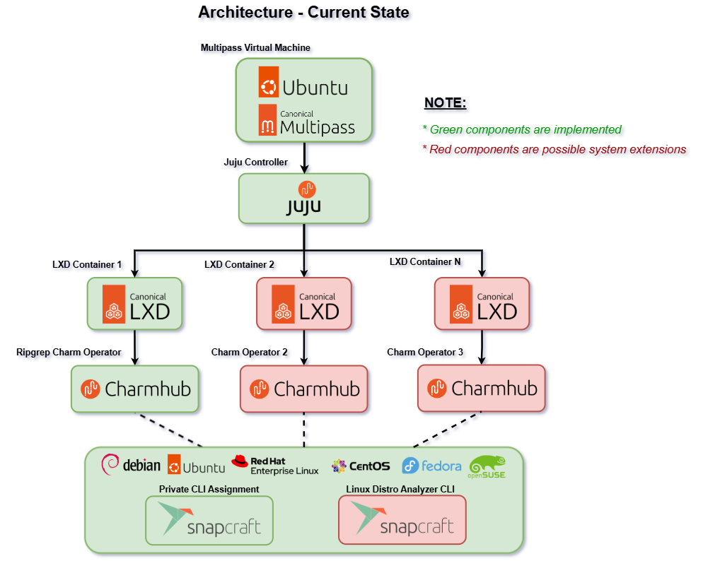
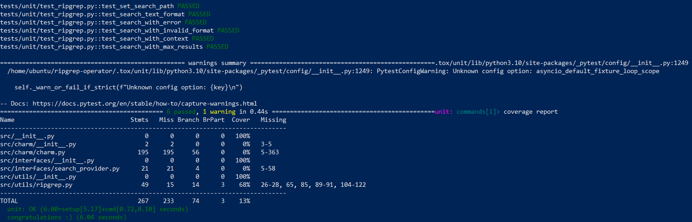

# Ripgrep Operator

[](https://charmhub.io)
[](https://snapcraft.io)
[](https://juju.is/)
[](https://linuxcontainers.org/lxd)
[](https://multipass.run)

> A Juju charm that provides ripgrep functionality as a service, enabling remote text search capabilities across different architectures and deployment scenarios.


## Architecture



*This charm operator integrates into a larger system, being managed on an Ubuntu environment with a central Juju orchestrator controller managing LXD containers for this very **Ripgrep Operator** that use CLIs distrubtable for multiple Linux distros packaged by Snapcraft*


## Quick Start

1. Setup Ubuntu environment

2. Run `./scripts/setup/setup-environment.sh`

Depending on your setup, you might need to manage a separate directory (a clone of the mounted one) in the virtual machine to bypass strict Linux permissions. If that's the case, you can use `./scripts/dev-lifecycle/sync-dir.sh` and `scripts/dev-lifecycle/get-snap-packages.sh` to sync directories and manage standalone Snap package CLIs.

3. Run `./scripts/dev-lifecycle/deploy-charm.sh X` where *X* is the number of the previous Juju model revision to be cleaned before launching the new revision. If no previous revisions exist (i.e if it's your first time running the operator) you don't need to pass any arguments

4. Now, as you've successfully deployed this operator, the next step is to test. For this, you can refer to two Bash scripts as examples of how these commands would look and interact with the operator. Note that all of these tests are categorized and based on the defined actions in *actions.yaml*:

- `scripts/tests/search-pattern-tests.sh`: Uses the *search-pattern* action, being the prominent feature of the public [Ripgrep](https://snapcraft.io/ripgrep) in Snapstore, essentially using recusrive searching for instances and patterns.

- `scripts/tests/debian-tests.sh`: Uses the *analyze-debian* and *compare-debian* that are actions specific to a private CLI tool accessed as a Snap package. In essence, this very ripgrep operator executes the package to get output data.

- `scripts/tests/debian-search-tests.sh` Uses the *search-and-analyze* action to recusrively search, filter and aggregate data from the output of a private CLI tool.

5. For further development and debugging, you can turn to `scripts/dev-lifecycle/juju-ssh-debug.sh` in cases where the `/src` code causes errors to obtain more detailed error logs.


## Business Value

The ripgrep operator wraps the high-performance ripgrep search tool in a Juju charm, making it remotely deployable, observable, and integratable with other cloud-native applications through standardized interfaces. By providing a cloud-native interface to ripgrep's powerful search capabilities, it enables automated, scalable text analysis across distributed systems, which is particularly valuable when combined with other tools for system analysis.


## Inspirational Sources

**Primary Sources:**

- [Postgresql Operator](https://github.com/canonical/postgresql-operator/tree/main?tab=security-ov-file)
- [Hydra Operator](https://github.com/canonical/hydra-operator)

**Secondary Sources:**

- [Prometheus Operator](https://github.com/canonical/prometheus-k8s-operator/tree/main)

**Other Sources:**

- [Charm Unit Tests](https://ops.readthedocs.io/en/latest/howto/write-unit-tests-for-a-charm.html)


## Unit Tests

While `requirements.txt` contains only runtime dependencies needed for the charm to function, `requirements-dev.txt` contains tools needed for development, testing and code quality. To be able to run the *unit* and *integration* tests located in `/tests` directory, you need to install from the latter .txt file to setup the *tox* command line utility.


1. Install development dependencies:

```bash
pip install -r requirements-dev.txt
```

2. Run tests:
```bash
tox -e unit        # Run unit tests
tox               # Run all tests and checks
```





---

Developed by Joel Mattsson