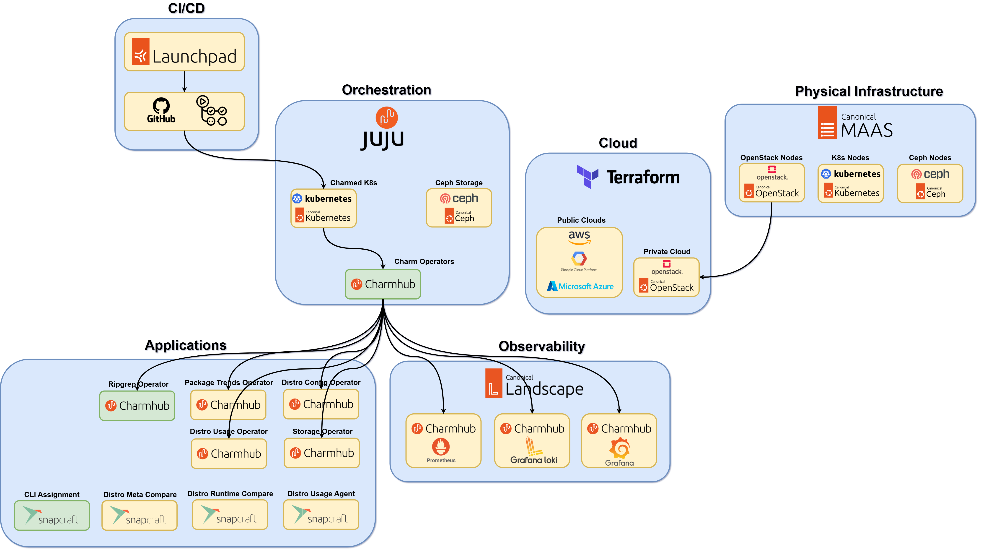

# Production-Grade System

Real-world use cases:

- **Distribution Maintainers:**
  - Understanding which packages are most used
  - Analyzing which default configs are most modified
  - Analyzing regional usage patterns

- **Enterprise Users:**
  - Making informed choices about distribution adoption
  - Planning migration strategies
  - Understanding common configuration patterns

## Physical Infrastructure Layer

- **OpenStack Nodes:** Hosts core infrastructure services and manages virtualized resources

- **K8s Nodes:** Runs containerized applications and manages workload distribution

- **Ceph Nodes:** Provides distributed storage for application data and analytics

## Orchestration Layer

- **Charmed K8s:** Manages container orchestration with Kubernetes-specific charms

- **Ceph Storage:** Manages distributed storage operations

- **Charm Operators:** Empty placeholder to simplify this diagram. In esence, it's a group of all Charm Operators, showing that they are connected to the *Orchestration Layer* as they are orchestrated with Juju

## Applications Layer

### Charms

- **Ripgrep Operator:** Combines recursive file search capabilities with Debian package analysis, enabling pattern matching across package statistics and system configurations

- **Package Trends Operator:** Stores package analysis results and maintains historical comparison data. Provides trend analysis capabilities

- **Distro Config Operator:** Captures and stores system configurations from different Linux Distros. Enables comparison between different distros' default configurations (network settings, security policies, package dependencies, init scripts, ...)

- **Distro Usage Operator:** Receives data from usage agents (the Snap package in the section below), aggregates data by region and stores data in Ceph

- **Storage Operator:** The central management point for Ceph storage operations, handling volume management and access control

### Snapcraft Packages

- **Private Assignment Task:** This very CLI assignment, where Debian mirrors and their Content indices with different architectures are analyzed

- **Distro Meta Compare:** Uses documentation scraping, release metadata and repository analysis to provide insights for different Linux Distros

- **Distro Runtime Compare:** Performs live system analysis using runtime containers to analyze configuration file structures and init system differences between the Linux Distros

- **Distro Usage Agent:** A lightweight agent that users (Linux users) can install. It collects anonymous usage data, reports package installations, tracks configuration changes and sends geographical metadata

## Observability Layer

- **Prometheus Operator:** Collects and stores metrics from all system components

- **Loki Operator:** Aggregates and indexes logs across the distributed system

- **Grafana Operator:** Visualizes metrics and provides monitoring dashboards

## Cloud Layer

- **Private Cloud:** OpenStack manages private infrastructure resources and services

- **Public Clouds:** The world leading cloud providers such as AWS, GCP and Azure can be integrated as public clouds
